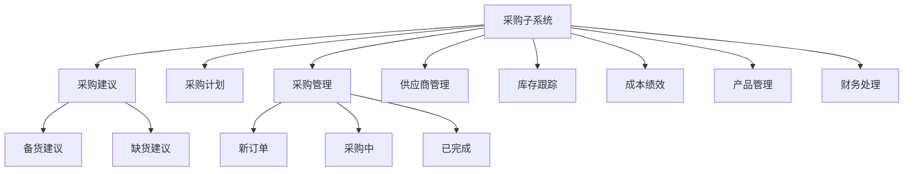
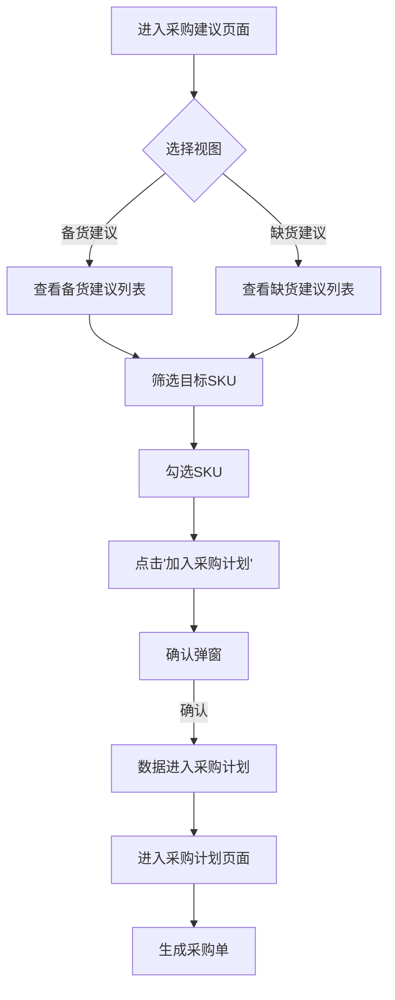
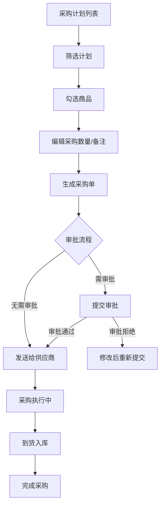

# 跨境电商ERP采购子系统 - 产品需求文档

## 1. 产品概述

### 1.1 产品定位
本产品是跨境电商ERP系统的采购子系统，为跨境电商卖家提供专业的采购管理解决方案。系统涵盖采购建议、采购计划、采购执行、供应商管理等核心模块，帮助企业实现智能化采购决策和高效的采购流程管理。

### 1.2 核心价值
- **智能化采购建议**：基于销量预测和库存数据自动计算建议采购量
- **高效采购流程**：从建议到计划再到采购单的完整流程管理
- **供应商管理**：全面的供应商信息管理和绩效评估
- **数据可视化**：丰富的报表和数据分析功能

### 1.3 技术架构
| 层级 | 技术栈 |
|------|--------|
| 前端框架 | React 18 + TypeScript |
| 构建工具 | Vite 6 |
| 样式方案 | TailwindCSS 3 |
| UI组件库 | shadcn/ui + Radix UI |
| 图标库 | Lucide React |
| 状态管理 | Zustand |

---

## 2. 用户角色与权限

| 角色 | 权限说明 | 核心操作 |
|------|----------|----------|
| **采购员** | 查看采购建议、生成采购计划、管理个人采购任务 | 查看建议、加入计划、生成采购单 |
| **采购主管** | 查看所有采购数据、审批采购计划、配置采购规则 | 审批计划、配置规则、查看报表 |
| **系统管理员** | 系统配置、用户管理、权限设置 | 系统设置、用户管理 |

---

## 3. 功能模块总览



---

## 4. 核心页面详情

### 4.1 采购建议页面

#### 4.1.1 页面结构
| 区域 | 功能描述 | 需求编号 |
|------|----------|----------|
| 顶部Tab | 备货建议/缺货建议切换 | [1] |
| 筛选区 | 多条件组合筛选 | [2] |
| 列表区 | 按供应商分组展示SKU数据 | [3] |
| 操作区 | 批量操作（加入计划、忽略等） | [4] |

#### 4.1.2 数据字段
| 字段类别 | 字段名称 | 说明 |
|----------|----------|------|
| 基础信息 | 采购员、库存SKU、中文名称、状态、仓库、品牌 | - |
| 销量数据 | 预测日销量、7天/28天/42天销量 | - |
| 库存数据 | 库存总数、采购在途量、未发货量、可用库存 | - |
| 计算指标 | 可售天数、库存+在途、建议采购数 | - |
| 采购信息 | 货期、采购单价、建议采购数、采购总价、备注 | - |

#### 4.1.3 业务规则
- **预测日销量计算公式**：`dailySales = dailySales1 * 0.3 + dailySales3 * 0.2 + dailySales7 * 0.25 + dailySales15 * 0.25`
- **可用库存**：`availableStock = stock - unshipped`
- **建议采购数**：`suggestedQuantity = ceil(dailySales * deliveryDays - stock - transit + unshipped)`
- **采购总价**：`totalPrice = suggestedQuantity * purchasePrice`

### 4.2 采购计划页面

#### 4.2.1 页面结构
| 区域 | 功能描述 | 需求编号 |
|------|----------|----------|
| 面包屑 | 层级导航 | [5] |
| 搜索区 | 多维度单选搜索 | [6] |
| 筛选区 | 仓库/来源/状态筛选 | [7] |
| 列表区 | 按采购员分组展示计划 | [8] |

#### 4.2.2 搜索类型
- 库存SKU
- 商品名称
- 采购计划号
- 备注
- 申请人
- 采购员

#### 4.2.3 计划状态
| 状态 | 说明 |
|------|------|
| 未采购 | 计划已创建但未生成采购单 |
| 已采购 | 已生成采购单并发送 |
| 搁置 | 计划被暂时搁置 |

### 4.3 采购管理页面

#### 4.3.1 订单状态
| 状态标签 | 说明 |
|----------|------|
| 全部 | 显示所有状态订单 |
| 新订单 | 刚创建的采购订单 |
| 待合并 | 等待合并的订单 |
| 采购中 | 正在采购执行中 |
| 已完成 | 采购完成 |
| 已作废 | 已取消的订单 |
| 异常 | 有异常的订单 |
| 1688对账 | 1688平台对账 |

#### 4.3.2 设置功能
- 基础设置：采购相关基础配置
- 第三方设置：对接第三方平台
- 审批设置：审批流程配置
- 合同设置：合同管理配置

### 4.4 供应商管理页面

#### 4.4.1 功能模块
| 模块 | 说明 |
|------|------|
| 供应商列表 | 展示所有供应商信息 |
| 编辑供应商 | 修改供应商基本信息 |
| 关联商品 | 管理供应商关联的商品 |
| 采购关联 | 查看供应商采购记录 |

### 4.5 库存跟踪页面

#### 4.5.1 核心功能
| 功能 | 说明 |
|------|------|
| 库存预警 | 设置库存预警规则 |
| 补货提醒 | 显示需要补货的SKU |
| 库存明细 | 查看各仓库库存详情 |
| 规则配置 | 自定义库存预警规则 |

### 4.6 成本降低绩效页面

#### 4.6.1 核心功能
| 功能 | 说明 |
|------|------|
| 成本分析 | 分析采购成本变化趋势 |
| 绩效报表 | 展示成本降低绩效 |
| 供应商对比 | 对比不同供应商价格 |

### 4.7 产品管理页面

#### 4.7.1 核心功能
| 功能 | 说明 |
|------|------|
| 商品列表 | 展示所有商品信息 |
| 添加商品 | 新增商品SKU |
| 商品编辑 | 修改商品信息 |
| 销售趋势 | 查看商品销售数据 |

### 4.8 财务处理页面

#### 4.8.1 核心功能
| 功能 | 说明 |
|------|------|
| 付款申请 | 提交付款申请 |
| 付款审批 | 审批付款申请 |
| 付款执行 | 执行付款操作 |

---

## 5. 核心业务流程

### 5.1 采购建议到采购计划流程



### 5.2 采购计划执行流程



---

## 6. 数据模型

### 6.1 采购建议数据模型

```typescript
interface SuggestionItem {
  id: string;
  buyer: string;           // 采购员
  sku: string;             // 库存SKU
  name: string;            // 中文名称
  status: string;          // 状态
  statusType?: 'blue' | 'orange' | 'green';
  warehouse: string;       // 仓库名称
  brand: string;           // 品牌
  dailySales: number;      // 预测日销量
  sales7Days: number;      // 7天销量
  sales28Days: number;     // 28天销量
  sales42Days: number;     // 42天销量
  stock: number;           // 库存总数
  transit: number;         // 采购在途量
  unshipped: number;       // 未发货量
  availableStock: number;  // 可用库存量
  availableDays: number;   // 可售天数
  deliveryDays: number;    // 货期
  purchasePrice: number;   // 采购单价
  suggestedQuantity: number; // 建议采购数
  totalPrice: number;      // 采购总价
  notes: string;           // 备注
}

interface SuggestionGroup {
  supplierName: string;
  totalProducts: number;
  totalSuggestedQuantity: number;
  totalSuggestedPrice: number;
  items: SuggestionItem[];
}
```

### 6.2 采购计划数据模型

```typescript
interface PlanItem {
  id: string;
  buyer: string;           // 采购员
  supplierName: string;    // 供应商名称
  sku: string;             // 库存SKU
  name: string;            // 商品名称
  warehouse: string;       // 仓库
  quantity: number;        // 采购数量
  purchasePrice: number;   // 采购单价
  inbound: string;         // 入库量
  loss: number;            // 损耗量
  notes: string;           // 备注
  logistics: string;       // 物流信息
  status: string;          // 采购状态
  source: string;          // 计划来源
  creator: string;         // 创建人
  createTime: string;      // 创建时间
}

interface PlanGroup {
  planNumber: string;      // 计划号
  buyerName: string;       // 采购员姓名
  totalProducts: number;   // 商品数量
  totalQuantity: number;   // 总采购数量
  totalPrice: number;      // 采购总价
  items: PlanItem[];       // 商品列表
}
```

---

## 7. UI设计规范

### 7.1 设计风格
- **主色调**：科技蓝（#2563EB）
- **辅助色**：绿色（正常状态）、橙色（警告状态）、红色（异常状态）
- **按钮风格**：圆角4px，扁平化设计
- **字体**：系统字体，12px-14px为主
- **布局**：左侧导航 + 顶部面包屑 + 中部筛选 + 底部表格

### 7.2 状态标签颜色
| 状态 | 颜色 | 图标 |
|------|------|------|
| 正常销售 | 绿色 | 🟢 |
| 缺货预警 | 橙色 | 🟠 |
| 自动创建 | 蓝色 | 🔵 |
| 新品 | 紫色 | 🟣 |
| 清仓 | 红色 | 🔴 |

### 7.3 响应式设计
- 最低适配：1280x720
- 表格支持横向/纵向滚动
- 侧边栏支持收起/展开

---

## 8. 标注说明

本项目已在以下位置添加PRD标注：

| 页面 | 标注位置 | 需求编号 |
|------|----------|----------|
| 采购建议 | Tab切换区域 | [1] |
| 采购建议 | 筛选区域 | [2] |
| 采购建议 | 列表区域 | [3] |
| 采购计划 | 面包屑导航 | [4] |
| 采购计划 | 搜索区域 | [5] |
| 采购计划 | 列表区域 | [6] |

**标注交互方式**：鼠标悬停黄色标记点显示需求详情tooltip，支持拖拽移动。

---

## 9. 测试覆盖

项目已包含以下测试文件：

| 模块 | 测试文件 | 测试内容 |
|------|----------|----------|
| 采购建议 | PurchaseSuggestionsPage.test.tsx | 页面功能测试 |
| 采购建议 | utils.test.ts | 工具函数测试 |
| 采购计划 | PlansTable.test.tsx | 表格组件测试 |
| 采购计划 | utils.test.ts | 工具函数测试 |
| 采购管理 | batchNoHidden.test.tsx | 批次隐藏测试 |
| 产品管理 | addProductFlow.test.tsx | 添加商品流程 |
| 产品管理 | calculations.test.ts | 计算逻辑测试 |
| 产品管理 | salesMock.test.ts | 销售数据测试 |
| 产品管理 | validators.test.ts | 表单验证测试 |
| 库存跟踪 | rules.test.ts | 规则配置测试 |
| 收货管理 | ScanReceive.search.test.tsx | 扫描收货测试 |
| 单品管理 | SettingsDialog.test.tsx | 设置弹窗测试 |
| 单品管理 | utils.test.ts | 工具函数测试 |

---

## 10. 版本历史

| 版本 | 日期 | 变更说明 |
|------|------|----------|
| v1.0 | 2026-06-01 | 初始版本，包含采购建议和采购计划核心功能 |
| v1.1 | 2026-06-01 | 补充库存跟踪、成本绩效、产品管理、财务处理等模块 |
